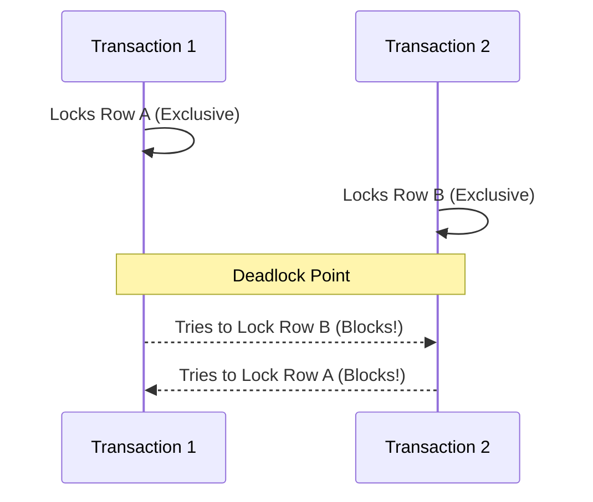

# 06. Transactions, Concurrency & ACID

For high-traffic applications, database concurrency control is critical. A senior-level engineer must understand how databases guarantee data integrity under heavy concurrent write loads, how locking works, and how to select the right transaction isolation level.

---

## 🧬 The ACID Properties

A transaction is a single logical unit of work. To maintain database integrity, the engine guarantees four core properties:

* **Atomicity ("All or Nothing")**:
  * Either all operations within a transaction succeed and are written to disk, or the entire transaction is rolled back, leaving the database unchanged.
  * *Implementation:* Handled by the Write-Ahead Log (WAL) or Undo Log.

* **Consistency ("State Transition Rules")**:
  * A transaction can only transition the database from one valid state to another, maintaining all schema constraints (keys, unique checks, data types, foreign keys).
  * *Implementation:* Handled by constraint checking and rollback systems.

* **Isolation ("Invisible Concurrency")**:
  * Concurrent execution of transactions should leave the database in the same state as if they were executed sequentially. No transaction should see the incomplete, in-flight changes of another.
  * *Implementation:* Handled by Locks or Multi-Version Concurrency Control (MVCC).

* **Durability ("Permanent Writing")**:
  * Once a transaction is committed, its changes are permanently recorded in non-volatile storage (disk) and will survive even if a sudden power loss occurs immediately after.
  * *Implementation:* Handled by flushing transaction logs to disk before returning success (group commit / fsync).

---

## ⚠️ Transaction Anomalies (Read Phenomena)

When multiple transactions run concurrently, several synchronization anomalies can occur if isolation levels are set too low:

### 1. Dirty Read
* **Symptom:** Transaction A reads data modified by Transaction B that **has not been committed yet**. If Transaction B rolls back, Transaction A's read data is invalid ("dirty").

### 2. Non-Repeatable Read (Fuzzy Read)
* **Symptom:** Transaction A reads a row. Transaction B **updates** that same row and commits. Transaction A reads the row again and sees the **updated values**. The value changed mid-transaction.

### 3. Phantom Read
* **Symptom:** Transaction A runs a query matching a search criteria (e.g. `WHERE salary > 50000`). Transaction B **inserts or deletes** a row that matches the criteria and commits. Transaction A re-runs the query and finds **new ("phantom") rows** or missing rows in the result set.

---

## 🛡️ Transaction Isolation Levels

To manage these anomalies, the SQL standard defines four transaction isolation levels. Higher isolation levels provide stronger safety but reduce concurrent throughput due to locking overhead.

| Isolation Level | Dirty Reads | Non-Repeatable Reads | Phantom Reads | Typical Mechanism |
| :--- | :--- | :--- | :--- | :--- |
| **`READ UNCOMMITTED`** |  **Allowed** |  **Allowed** |  **Allowed** | No locks for reads. |
| **`READ COMMITTED`** | ❌ **Prevented** |  **Allowed** |  **Allowed** | Read locks released instantly. (Default in Postgres/SQL Server) |
| **`REPEATABLE READ`** | ❌ **Prevented** | ❌ **Prevented** |  **Allowed** *(See Note)*| Read locks held until commit. (Default in MySQL InnoDB) |
| **`SERIALIZABLE`** | ❌ **Prevented** | ❌ **Prevented** | ❌ **Prevented** | Range/Key locking or Serializable Snapshot Isolation. |

> [!NOTE]
> **Dialect Edge Cases:** In MySQL (InnoDB) and PostgreSQL, `REPEATABLE READ` actually prevents Phantom Reads as well, using Multi-Version Concurrency Control (MVCC) snapshot reads, which is a major performance boost over standard pessimistic range locks!

---

## 🔒 Database Locking Mechanics

To enforce isolation, database engines employ various locking strategies.

### 1. Shared (S) vs. Exclusive (X) Locks
* **Shared Lock (S-Lock / Read Lock)**:
  * Acquired when reading data.
  * **Compatibility:** Multiple transactions can hold S-locks on the same resource simultaneously.
* **Exclusive Lock (X-Lock / Write Lock)**:
  * Acquired when writing/modifying data.
  * **Compatibility:** No other transaction can hold *any* lock (S or X) on that resource. It blocks everyone.

### 2. Lock Granularity
* **Row-Level Lock**: High concurrency, high overhead (memory needed to track individual row locks).
* **Page/Block-Level Lock**: Middle ground. Locks a memory block containing multiple rows.
* **Table-Level Lock**: Low overhead, low concurrency. Blocks all other writes to the table.

### 3. Intent Locks (`IS` and `IX`)
Before acquiring a lock on a row, the transaction must place an **Intent Lock** at the table level (e.g. Intent Exclusive `IX`).
* **Why?** It tells other transactions wishing to lock the entire table that there is a fine-grained row lock active inside, avoiding the need for the engine to scan millions of rows to check if a lock exists.

---

## 🛡️ Pessimistic vs. Optimistic Locking

### 1. Pessimistic Locking
* **Philosophy:** "Assume conflicts will happen. Lock early."
* **Implementation:** Use `SELECT ... FOR UPDATE` (or `FOR SHARE`). This blocks other transactions from reading/writing the target rows until the current transaction commits.
* **Best for:** High conflict environments with low latency requirements where transaction failures are expensive.

### 2. Optimistic Locking (Optimistic Concurrency Control - OCC)
* **Philosophy:** "Assume conflicts are rare. Check before writing."
* **Implementation:** No database-level locks are held during reading. Instead, each row has a `version_number` or `updated_at` timestamp.
  ```sql
  -- Step 1: Read row and remember the version
  SELECT id, balance, version FROM accounts WHERE id = 12; -- version = 5
  
  -- Step 2: Update only if version has not changed
  UPDATE accounts 
  SET balance = balance + 100, version = version + 1
  WHERE id = 12 AND version = 5;
  ```
  If the `UPDATE` returns `0` affected rows, another transaction modified it first. The application rolls back and retries.
* **Best for:** Low-conflict environments, web architectures, or long-lived transactions where holding DB locks is unacceptable.

---

## 💀 Deadlocks

A deadlock occurs when two transactions are blocked, each waiting for a lock held by the other.



### Detection & Resolution:
Modern databases run a background thread (Deadlock Detector) that constructs a **Wait-For Graph**. If a cycle is detected, the engine forcibly kills and rolls back one of the transactions (the "victim," usually the one that has done the least amount of work) to let the other proceed.

### 💡 High-Yield Prevention Tips for Developers:
1. **Access tables in a consistent order:** Ensure all API endpoints acquire locks in the same order (e.g., always lock `accounts` then `transactions`).
2. **Keep transactions short:** Minimize the time locks are held. Do not put external API calls or user prompts inside a database transaction.
3. **Use the lowest acceptable isolation level** for your business logic.

---

## 🎯 Interview Checkpoints & Questions

1. **What is the difference between `REPEATABLE READ` and `SERIALIZABLE`?**
   * *Answer:* `REPEATABLE READ` ensures that if you query a row multiple times, its values won't change. However, it can suffer from Phantom Reads (new rows inserted by other transactions). `SERIALIZABLE` is the highest level, enforcing strict order equivalent to sequential runs by locking ranges of keys, preventing all anomalies, including Phantoms.
2. **How does Optimistic Locking work, and does it use database locks?**
   * *Answer:* Optimistic locking does not hold physical database locks during the read phase. Instead, it relies on a version or timestamp column. When writing, it issues an `UPDATE ... WHERE version = last_seen_version`. If another process updated the row in the meantime, the version mismatch prevents the update, and the application must handle the conflict (e.g. by retrying).
3. **What is a "Dirty Read" and which isolation level prevents it?**
   * *Answer:* A dirty read occurs when a transaction reads uncommitted changes written by another concurrent transaction. It is prevented by the `READ COMMITTED` isolation level (and any level above it).
