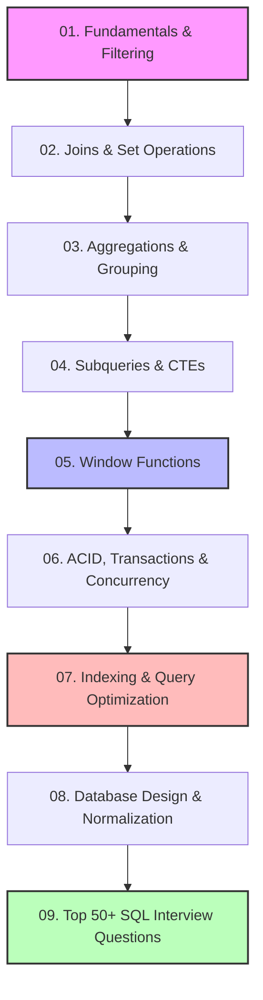

# 🐘 SQL Mastery: Ultimate Interview & Learning Guide

> [!TIP]
> **Confused or overwhelmed by database concepts?** Start with the **[🎯 Ultimate SQL Interview-Cracking Blueprint](./00_ultimate_interview_cracking_blueprint.md)**. It breaks SQL down into the 5 core mental models and patterns you need to pass engineering interviews without getting lost in syntax.

Welcome to the **SQL Mastery** curriculum! This repository is designed to take you from foundational concepts to advanced, enterprise-grade database engineering and optimization. Every section is tailored specifically to address **high-frequency interview questions**, **performance tuning tradeoffs**, and **architectural decisions**.

---

## 🗺️ Master Curriculum Roadmap

---

## 📂 Folder Structure & Study Guides

Click on any guide below to deep-dive into the corresponding concepts, syntax, edge cases, and interview pointers.

| File Name | Topic | High-Value Interview Targets |
| :--- | :--- | :--- |
| **[00_ultimate_interview_cracking_blueprint.md](./00_ultimate_interview_cracking_blueprint.md)** | 🎯 Quick Start SQL Interview Blueprint | **Logical execution order**, Venn diagram alternative, **Window functions comparison**, **5 Core coding templates**. |
| **[01_fundamentals_and_filtering.md](./01_fundamentals_and_filtering.md)** | Fundamentals & Filtering | `SELECT`, `WHERE`, `LIKE`, `IN`, `BETWEEN`, `NULL` handling, `LIMIT`/`OFFSET` pagination, operator precedence. |
| **[02_joins_and_set_operations.md](./02_joins_and_set_operations.md)** | Joins & Set Operations | `INNER`, `LEFT`/`RIGHT`, `FULL OUTER`, `CROSS`, `SELF` joins, `UNION` vs `UNION ALL`, `INTERSECT`, `EXCEPT`. Joins on non-key columns. |
| **[03_aggregations_and_grouping.md](./03_aggregations_and_grouping.md)** | Aggregations & Grouping | `GROUP BY`, `HAVING` vs `WHERE`, aggregate functions (`COUNT(1)` vs `COUNT(col)` vs `COUNT(*)`), `STRING_AGG`/`GROUP_CONCAT`. |
| **[04_subqueries_and_ctes.md](./04_subqueries_and_ctes.md)** | Subqueries & CTEs | Correlated vs non-correlated subqueries, CTEs, Recursive CTEs (generating series, hierarchy traversal). |
| **[05_window_functions.md](./05_window_functions.md)** | Advanced Window Functions | `ROW_NUMBER()`, `RANK()`, `DENSE_RANK()`, `LEAD()`, `LAG()`, `NTILE()`, running totals, moving averages, sliding window frames. |
| **[06_transactions_concurrency_acid.md](./06_transactions_concurrency_acid.md)** | ACID, Transactions & Locking | ACID properties, isolation levels (Dirty, Non-repeatable, Phantom reads), Shared vs Exclusive locks, Deadlocks. |
| **[07_indexing_performance_tuning.md](./07_indexing_performance_tuning.md)** | Indexing & Optimization | B-Tree vs Hash indexes, Clustered vs Non-clustered, `EXPLAIN` & `EXPLAIN ANALYZE`, SARGable queries, index design patterns. |
| **[08_database_design_normalization.md](./08_database_design_normalization.md)** | Schema Design & Normalization | 1NF, 2NF, 3NF, BCNF, Primary/Foreign keys, constraints, triggers, views, materialized views, when to denormalize. |
| **[09_interview_questions_and_scenarios.md](./09_interview_questions_and_scenarios.md)** | 50+ Classic Interview Questions | N-th highest salary, duplicate deletion, consecutive active days, running balances, department top-N earners, pivot/unpivot. |

---

## 🔑 Master Keyword Cheat Sheet

Here is a quick-reference index of every major SQL keyword, classified by its functional category and utility.

| Keyword | Category | Description | Crucial Interview Tip |
| :--- | :--- | :--- | :--- |
| **`SELECT`** | DQL | Retrieves rows from one or more tables. | Always project only the columns you need (`SELECT *` hurts performance). |
| **`DISTINCT`** | DQL | Removes duplicate rows from the results. | Performs an implicit sort/hash, which can be expensive on large datasets. |
| **`WHERE`** | DQL | Filters rows *before* any grouping occurs. | Ensure filtered columns are indexed. Cannot contain aggregate functions. |
| **`AND / OR / NOT`**| Logical | Combines multiple conditions in filters. | Beware of operator precedence; use parentheses explicitly to avoid bugs. |
| **`ORDER BY`** | DQL | Sorts the result set (default: `ASC`). | Sorting large unindexed datasets triggers expensive disk writes (filesorts). |
| **`LIMIT / OFFSET`**| DQL | Constrains result count; skips rows. | Large offsets (e.g. `OFFSET 100000`) degrade performance due to row-scanning. |
| **`INSERT`** | DML | Adds new rows to a table. | Batch inserts are significantly faster than individual single-row inserts. |
| **`UPDATE`** | DML | Modifies existing rows. | Always test your `WHERE` clause first to avoid accidentally updating all rows. |
| **`DELETE`** | DML | Removes rows (can be rolled back). | Triggers delete triggers and writes to transaction log. Use `TRUNCATE` if purging. |
| **`TRUNCATE`** | DDL | Drops all rows in a table (cannot rollback in some DBs). | Fast; does not scan rows or fire delete triggers. Resets auto-increment IDs. |
| **`DROP`** | DDL | Deletes table, view, or database structure completely. | Irreversible structural deletion. Removes all data, indexes, and triggers. |
| **`ALTER`** | DDL | Modifies existing database objects (adds columns, etc.). | Can lock large tables during schema migration. Look into online schema tools. |
| **`LIKE`** | Operator| Performs wildcard matching (`%` and `_`). | Wildcards at start (`'%abc'`) prevent index usage (non-SARGable). |
| **`IN`** | Operator| Checks value against a list or subquery. | Can be rewritten as an `EXISTS` subquery or a `JOIN` for better optimization. |
| **`BETWEEN`** | Operator| Filters within an inclusive range (`low AND high`). | Remember that it is inclusive. Be careful with datetime boundaries! |
| **`IS NULL`** | Operator| Checks for missing or unassigned values. | Standard comparison operators (`=`, `!=`) return `UNKNOWN` for `NULL`. |
| **`EXISTS`** | Operator| Returns true if subquery returns at least one row. | Highly optimized because it short-circuits as soon as a match is found. |
| **`JOIN`** | Operator| Merges columns from tables based on matching keys. | Pay attention to join order and index availability on matching keys. |
| **`UNION`** | Set Op | Combines results, removing duplicates. | Requires implicit deduplication (expensive). Use `UNION ALL` if duplicates are fine. |
| **`GROUP BY`** | DQL | Groups rows that have the same values into summary rows. | All non-aggregate selected columns MUST be in the `GROUP BY` clause. |
| **`HAVING`** | DQL | Filters groups *after* aggregation has occurred. | Filters on aggregate functions (e.g. `HAVING COUNT(*) > 5`). |
| **`OVER`** | Window | Defines the window partition and ordering for window functions. | Crucial for keeping original row context while calculating aggregations. |
| **`PARTITION BY`**| Window | Divides rows into groups for window calculation. | Similar to `GROUP BY` but does not collapse the final output rows. |
| **`CASE WHEN`** | Logical | Evaluates conditions and returns a value (if-then-else). | Used for conditional aggregation, pivoting data, and custom sorting. |
| **`COALESCE`** | Function| Returns the first non-null value in the argument list. | Indispensable for replacing null values with defaults or fallbacks. |
| **`CAST / CONVERT`**| Function| Converts a value from one data type to another. | Avoid casting indexed columns in the `WHERE` clause (prevents index usage). |

---

## 🚀 Recommended Interview Study Plan

1. **Day 1: Basics & Filtering (`01`)**
   - Understand the SQL logical query processing phase sequence.
   - Master `NULL` three-valued logic (`TRUE`, `FALSE`, `UNKNOWN`).
2. **Day 2: Joins & Set Operations (`02`)**
   - Visualize Joins as Venn diagrams and Cartesian products with filters.
   - Master the difference between `UNION` and `UNION ALL`.
3. **Day 3: Aggregations & Subqueries (`03` & `04`)**
   - Differentiate `WHERE` and `HAVING`.
   - Master CTEs and recursive hierarchies (e.g., manager-employee relationships).
4. **Day 4: Window Functions (`05`)**
   - Practice the differences between `ROW_NUMBER()`, `RANK()`, and `DENSE_RANK()`.
   - Master analytical functions (`LEAD`, `LAG`, and frame boundaries `ROWS BETWEEN`).
5. **Day 5: Transactions, Optimization & Design (`06`, `07`, `08`)**
   - Deeply understand indexes (B-Tree, Clustered vs Non-Clustered).
   - Memorize transaction isolation levels and read phenomena.
   - Learn the normalization steps (1NF, 2NF, 3NF).
6. **Day 6 & 7: Scenario Practice (`09`)**
   - Code through the top 50+ interview questions.
   - Solve medium/hard problems on platforms like LeetCode SQL 50, HackerRank, or StrataScratch.

---

> [!TIP]
> **Pro-Tip for SQL Interviews:** 
> When writing queries during an interview, always explain the **logical execution order** (which starts with `FROM` / `JOIN`, not `SELECT`) and discuss the **Big-O time complexity** and **index strategy** for your proposed solution. Showing you care about production performance will instantly set you apart from 90% of candidates.
